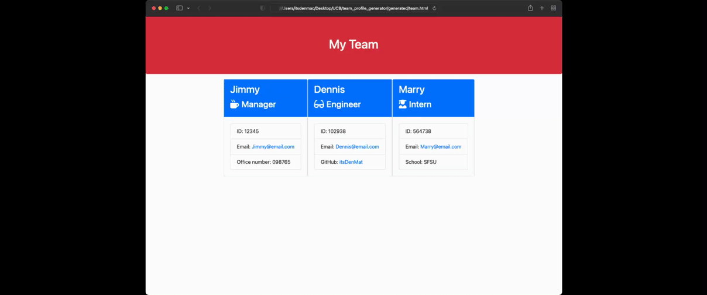

# team_profile_generator
This is a Node.js command-line application that takes in information about employees on a software engineering team, then generates an HTML webpage that displays summaries for each person. This is an object-oriented programming focused project.

## Table of Contents
* [Installation](#installation)
* [Usage](#usage)
* [DEMO](#demo)
* [Testing](#testing)
* [License](#license)
* [Questions](#questions?)

## Installation
In able to use the application and generate your own team profile generator, you will have to `git clone` the repository to your local storage. This will enable you to access all the files locally.

Run `npm install` in order to install the following npm package dependencies that are specified in the `package.json`, which are the following dependencie(s);
> [`inquirer`](https://www.npmjs.com/package/inquirer) will take care of prompting you for the necessary inputs from the user through the command line.

* The application will start once the user enters `node index` in the command line.

* Select between `Engineer`, `Manager`, or `Intern`.

* Each selection will initiate prompts in the command line to populate the HTML file.

* After successfully answering the prompts, and filled up the needed employee information, you will receive a notification `Team successfully created!`

* Your HTML file will be named <strong>_team.html_</strong> and will be ready in the `generated` folder.

## Usage
When you run the application using `node index`, the application will automatically use the `inquirer` package to provide prompts in the command line. This prompts consist of series of questions that will be reflected in the HTML file.

The application will then generate the HTML file and display the necessary information based on your responses to the prompts. The file will also include specific icons for each kind of employees.

At the very end, `fs.writeFile` will generate your HTML file.

## DEMO
* Initiating the application and going through the prompts.

* Displaying the HTML generated from the datas collected from answering the prompts

* GitHub profile opens in a new tab whenever the link is clicked.

## Testing
Enter `npm test` in the terminal to initiate test for the application. This process is show below.

## Video Demo Links
[Answering Prompts](https://drive.google.com/file/d/1Pg533EtnFy9ZHeKMcxhXFWYoRtpp-wJB/view)

[Display Generated HTML file](https://drive.google.com/file/d/1ZQtI2wZJACHbmh0-brk_5M47LvurKqqt/view)

[Application Testing](https://drive.google.com/file/d/1QT-bF7NhxMtov3lZTk8C9wPnlAbX5dah/view)

## License
ISC

___
## Questions? 
Fell free contact me with any questions regarding this application using the information provided below:

GitHub: [itsDenMat](https://github.com/itsDenMat)
